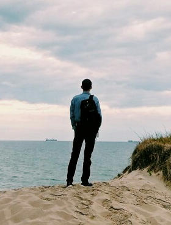

<!DOCTYPE html>
<html lang="ru">

<head>
  <meta charset="utf-8">
  <meta name="viewport" content="width=device-width, initial-scale=1">
  <meta http-equiv="x-ua-compatible" content="ie=edge">
  <link rel="icon" href="img/favicon.png" type="image/png">
  <title>Резюме: Николаев Павел</title>
  <!-- Font Awesome -->
  <link rel="stylesheet" href="https://use.fontawesome.com/releases/v5.8.2/css/all.css">
  <!-- Bootstrap core CSS -->
  <link href="css/bootstrap.min.css" rel="stylesheet">
  <!-- Material Design Bootstrap -->
  <link href="css/mdb.min.css" rel="stylesheet">
  <!-- Lightbox -->
  <link href="css/lightbox.css" rel="stylesheet">
  <!-- Your custom styles (optional) -->
  <link href="css/style.css" rel="stylesheet">
</head>

<body>

  <!-- Preloader -->
  

    

      

        
      

      
Загрузка

    

  

  <!-- Preloader -->

  <!-- Main content -->
  

    

      <!-- 
 -->

        <!-- Header section -->
        

          <h1 class="mb-4 text-center">Резюме</h1>
          

            

              <figure class="figure">
                
                <figcaption class="figure-caption text-right">Зеленоградск, 2018.</figcaption>
              </figure>
            

            

              
Фамилия: Николаев

              
Имя: Павел

              

              
Возраст: 20 лет

              
Образование: неоконченное высшее (4 курс)

              

              
Специализация: Full-Stack веб-разработчик

              
Опыт работы: 1.5 года

              

              
Контакты:

              

                <button type="button" class="btn btn-sm btn-vk"><i class="fab fa-vk pr-1"></i>&nbsp;<a href="https://vk.com/ukickeru" target="_blank">Vkontakte</a></button>
                <button type="button" class="btn btn-sm btn-git"><i class="fab fa-github pr-1"></i>&nbsp;<a href="https://github.com/ukickeru" target="_blank">Github</a></button>
                <button type="button" class="btn btn-sm btn-email"><i class="fas fa-envelope pr-1"></i>&nbsp;<a href="" data-toggle="modal" data-target="#modalContactForm">Email</a></button>
              

            

          

        

        <!-- Header section -->

        <!-- Main section -->
        

          <!-- Navigation tablist -->
          <ul class="nav nav-tabs" id="myTab" role="tablist">
            <li class="nav-item">
              <a class="nav-link active" id="about-tab" data-toggle="tab" href="#about" role="tab" aria-controls="about"
                aria-selected="true"><i class="fas fa-user"></i>&nbsp;О себе</a>
            </li>
            <li class="nav-item">
              <a class="nav-link" id="education-tab" data-toggle="tab" href="#education" role="tab" aria-controls="education"
                aria-selected="false"><i class="fas fa-user-graduate"></i>&nbsp;Образование</a>
            </li>
            <li class="nav-item">
              <a class="nav-link" id="achievements-tab" data-toggle="tab" href="#achievements" role="tab" aria-controls="achievements"
                aria-selected="false"><i class="fas fa-trophy"></i>&nbsp;Достижения</a>
            </li>
            <li class="nav-item">
              <a class="nav-link" id="skills-tab" data-toggle="tab" href="#skills" role="tab" aria-controls="skills"
                aria-selected="false"><i class="fas fa-code"></i>&nbsp;Навыки</a>
            </li>
            <li class="nav-item">
              <a class="nav-link" id="experience-tab" data-toggle="tab" href="#experience" role="tab" aria-controls="experience"
                aria-selected="false"><i class="fas fa-briefcase"></i>&nbsp;Портфолио</a>
            </li>
          </ul>
          <!-- Navigation tablist -->

          <!-- Tab content -->
          

            <!-- About -->
            

              

                <h5 class="tab-pane__header text-center">О себе вкратце</h5>
                <h5>Питаю к IT страсть с детства. В 2016-м сдал ЕГЭ по информатике, поступил в КГТУ на специальность "информатика и вычисительная техника". Стал активно изучать компьютеры с 3 курса. Самостоятельно начал изучение с Web-программирования.</h5>

                <ul class="no-markers pl-3 py-3">
                  <li class="mt-4">
                    

                      

                        <i class="fab fa-html5"></i>
                      

                      <h5> Владею базовым стэком html+css+js, в основном использую mdbootstrap, jquery и разные библиотеки.</h5>
                    

                  </li>
                  <li class="mt-4">
                    

                      

                        <i class="fab fa-php"></i>
                      

                      <h5>Также разбираюсь в бэкенде, пишу на PHP. Начал изучать Laravel, знаю mysql, работал с разными мелкими библиотеками.</h5>
                    

                  </li>
                  <li class="mt-4">
                    

                      

                        <i class="fab fa-wordpress"></i>
                      

                      <h5>Из CMS в основном работал с WordPress, также имел дело с 1C Bitrix и OpenCart.</h5>
                    

                  </li>
                  <li class="mt-4">
                    

                      

                        <i class="fas fa-server"></i>
                      

                      <h5>Администрирование: имел дело с Debian 9, немного Docker и Nginx. Большинство проектов работали на Apache. Пользуюсь Git.</h5>
                    

                  </li>
                  <li class="mt-4">
                    

                      

                        <i class="fas fa-microchip"></i>
                      

                      <h5>Благодаря специальности также разбираюсь в электронике и схемотехнике ЭВМ, хочу ближе познакомиться с системным программированием.</h5>
                    

                  </li>
                </ul>

                <h5 class="tab-pane__header text-center">Будущее</h5>
                

                  

                      <h5 style="margin-bottom: 0;">Давайте сотрудничать!   Если мне удалось заинтересовать Вас, свяжитесь со мной:</h5>
                  

                  

                    <button type="button" class="btn btn-sm btn-vk"><i class="fab fa-vk pr-1"></i>&nbsp;<a href="https://vk.com/ukickeru" target="_blank">Vkontakte</a></button>
                    <button type="button" class="btn btn-sm btn-git"><i class="fab fa-github pr-1"></i>&nbsp;<a href="https://github.com/ukickeru" target="_blank">Github</a></button>
                    <button type="button" class="btn btn-sm btn-email"><i class="fas fa-envelope pr-1"></i>&nbsp;<a href="" data-toggle="modal" data-target="#modalContactForm">Email</a></button>
                  

                

              

            

            <!-- About -->

            <!-- Education -->
            

              

                <ul class="stepper stepper-vertical px-0 mx-0">

                  <li class="completed success">
                    <a href="#">
                      <i class="fas fa-dot-circle"></i>
                      Школа
                    </a>
                    

                      <h5>2007 - 2011:</h5>
                      <h6>школа №1, Калужская область</h6>
                      <h5>2011 - 2016:</h5>
                      <h6>школа №4, г. Калининград</h6>
                    

                  </li>

                  <li class="active">
                    <a href="#">
                      <i class="fas fa-dot-circle"></i>
                      Высшее образование
                    </a>
                    

                      <h5>2016 - настоящее время: </h5>
                      <h6>Калининградский государственный технический университет 
                          Факультет автоматизации производства и управления 
                          Кафедра систем управления и вычислительной техники 
                          Специальность: информатика и вычислительная техника
                      </h6>
                    

                  </li>

                </ul>
              

            

            <!-- Education -->

            <!-- Achievements -->
            

              

                <ul class="stepper stepper-vertical px-0 mx-0">

                  <li class="completed success">
                    <a href="#">
                      <i class="fas fa-dot-circle"></i>
                      Школа
                    </a>
                    

                      <h5>2007 - 2015:</h5>
                      <h6>участие в олимпиадах по информатике; 
                          спортивные соревнования.
                      </h6>
                      <h5>2016:</h5>
                      <h6>самый высокий общий балл в школе по результатам ЕГЭ за год; 
                      </h6>
                    

                  </li>

                  <li class="active">
                    <a href="#">
                      <i class="fas fa-dot-circle"></i>
                      Университет
                    </a>
                    

                      <h5>2016 - настоящее время:</h5>
                      <h6>участие в спортивных соревнованиях.</h6>
                    

                  </li>

                </ul>
              

            

            <!-- Achievements -->

            <!-- Skills -->
            

              

                <ul class="stepper stepper-vertical px-0 mx-0">

                  <li class="completed failure">
                    <a href="#">
                      <i class="fas fa-dot-circle"></i>
                      Системное администрирование в АО "Институт «Запводпроект»"
                    </a>
                    

                      <h5>Сентябрь - октябрь 2018 (работа в должности инженера-системотехника):</h5>
                      <h6>В обязанности входило: обслуживание компьютеров (диагностика, ремонт, замена компонентов, настройка ПО и т.д.), обслуживание ЛВС, обслуживание периферийной техники (диагностика, принятие решений и т.п.).</h6>
                      

                      <h6>Первый опыт работы в сфере IT. Понимая собственную некомпетентность, уволился по с/ж.</h6>
                    

                  </li>

                  <li class="completed success">
                    <a href="#">
                      <i class="fas fa-dot-circle"></i>
                      Веб-дизайн
                    </a>
                    

                      <h5>Освоение инструментов и техник дизайна: </h5>
                      <h6>Работа в Figma, Adobe XD, Adobe Photoshop. 
                          Освоены фундаментальные понятия типографики и разметки, правила построения макетов, приёмы и методы их создания, изучен процесс взаимодействия дизайнера с остальными членами команды (верстальщики, другие дизайнеры, клиент), получено системное понимание процессов создания интерфейсов (сайтов / приложений), в том числе - в процессах, описанных в следующих пунктах.
                      </h6>
                    

                  </li>

                  <li class="completed success">
                    <a href="#">
                      <i class="fas fa-dot-circle"></i>
                      Фронтенд
                    </a>
                    

                      <h5>Освоение инструментов и техник вёрстки: </h5>
                      <h6>Освоены основы вёрстки, стилизации и программирования (HTML, CSS, JS), базовые понятия в области веб (основы сетевого взаимодйствия, стек протоколов TCP/IP, протоколы HTTP, HTTPS, FTP, SSH и др., клиент-серверное взаимодействие, работа движка JS, DOM), освоена разметка (строчно-блочная модель, сложное позиционирование, правильное именование элементов в нотации БЭМ и т.п.), освоены таблицы стилей, освоен JS (ООП и функциональное программирование, работа с библиотеками jQuery, Leaflet и др.). 
                          Усвоена работа с современными популярным фреймворком: Bootstrap и его версией Material Design Bootstrap.
                      </h6>
                    

                  </li>

                  <li class="completed success">
                    <a href="#">
                      <i class="fas fa-dot-circle"></i>
                      Бэкенд
                    </a>
                    

                      <h5>Освоение бэкенд-разработки: </h5>
                      <h6>Освоены основы программирования серверной части приложения, базовые понятия в области веб (основы сетевого взаимодйствия, стек протоколов TCP/IP, протоколы HTTP,HTTPS, FTP, SSH и др., клиент-серверное взаимодействие, работа интерпретатора PHP, изучен Linux на примере Debian 9 и Cent OS), освоена работа со встроенным функционалом PHP, сторонними библиотеками (например: PHPMailer, RedBeans). 
                          Знаком с фреймворками CodeIgniter, Laravel.
                      </h6>
                    

                  </li>

                </ul>
              

            

            <!-- Skills -->

            <!-- Experience -->
            

              

                <ul class="stepper stepper-vertical px-0 mx-0">

                  <!-- Food4You -->
                  <li class="completed success projects">
                    <a href="#">
                      <i class="fas fa-dot-circle"></i>
                      Кастомный веб-сайт "с нуля"
                    </a>

                    

                      <h5>Веб-сайт пекарни "Еда для тебя":</h5>
                      <h6><i class="attribute">Дата создания:</i> сентябрь - декабрь 2018 года. 
                          <i class="attribute">Адрес:</i> <a href="https://food4you.me">https://food4you.me</a> (недоступен). 
                          <i class="attribute">Цель:</i> создание легковесного, простого сайта-каталога с информацией о продукции пекарни, о самой пекарне, возможностью заказа продукции посредством отправки заявки на email. 
                          <i class="attribute">Решение:</i> по согласованию с заказчиком, написание сайта "с нуля", используя стандартные средства html, css, js и php, а также несколько библиотек (jQuery, lightbox, PHPMailer). Впоследствии был размещён на shared-хостинге.
                      </h6>
                      

                      <h6 class="text-center subheader">Результат:</h6>

                      <!-- Images -->
                      

                        

                          

                            

                              

                                <a class="lightbox-overlay" href="img/projects/food4you/img (1).jpg" data-lightbox="food4you" data-title="Общий вид">
                                  
                                  

                                    
Общий вид

                                  

                                </a>
                              

                            

                            

                              

                                <a class="lightbox-overlay" href="img/projects/food4you/img (2).jpg" data-lightbox="food4you" data-title="Общий вид">
                                  
                                  

                                    
Описание товара

                                  

                                </a>
                              

                            

                            

                              

                                <a class="lightbox-overlay" href="img/projects/food4you/img (3).jpg" data-lightbox="food4you" data-title="Окно заказа, верхняя часть">
                                  
                                  

                                    
Окно заказа, верхняя часть

                                  

                                </a>
                              

                            

                            

                              

                                <a class="lightbox-overlay" href="img/projects/food4you/img (4).jpg" data-lightbox="food4you" data-title="Карточка товара">
                                  
                                  

                                    
Карточка товара

                                  

                                </a>
                              

                            

                            

                              

                                <a class="lightbox-overlay" href="img/projects/food4you/img (5).jpg" data-lightbox="food4you" data-title="Карточка товара и таблица заказа">
                                  
                                  

                                    
Карточка товара и таблица заказа

                                  

                                </a>
                              

                            

                            

                              

                                <a class="lightbox-overlay" href="img/projects/food4you/img (6).jpg" data-lightbox="food4you" data-title="Окно заказа, нижняя часть">
                                  
                                  

                                    
Окно заказа, нижняя часть

                                  

                                </a>
                              

                            

                            

                              

                                <a class="lightbox-overlay" href="img/projects/food4you/img (7).jpg" data-lightbox="food4you" data-title="Боковое меню">
                                  
                                  

                                    
Боковое меню

                                  

                                </a>
                              

                            

                          

                        

                      

                      <!-- Images -->

                    

                  </li>
                  <!-- Food4You -->

                  <!-- LorenzioSchool -->
                  <li class="completed success projects">
                    <a href="#">
                      <i class="fas fa-dot-circle"></i>
                      Landing page
                    </a>

                    

                      <h5>Веб-сайт школы дизайна "Lorenzio School":</h5>
                      <h6><i class="attribute">Дата создания:</i> сентябрь - октябрь 2018 года. 
                          <i class="attribute">Адрес:</i> <a href="https://lorenzioschool.net">https://lorenzioschool.net</a> (активен). 
                          <i class="attribute">Цель:</i> создание простого презентационного сайта с возможностью ведения блога, удобной и простой системой управления, размещённой информацией о школе, возможностью записи на курсы посредством отправки заявки на email. 
                          <i class="attribute">Решение:</i> CMS WordPress с согласованной с заказчиком темой, впоследствии отредактированной в WYSIWYG редакторе Elementor, дополненной плагинами и наполненной в соответствии с требованиями заказчика. Впоследствии был размещён на shared-хостинге.
                      </h6>
                      

                      <h6 class="text-center subheader">Результат:</h6>

                      <!-- Images -->
                      

                        

                          

                            

                              

                                <a class="lightbox-overlay" href="img/projects/lorenzioschool/img (1).jpg" data-lightbox="lorenzioschool" data-title="Главный экран">
                                  
                                  

                                    
Главный экран

                                  

                                </a>
                              

                            

                            

                              

                                <a class="lightbox-overlay" href="img/projects/lorenzioschool/img (2).jpg" data-lightbox="lorenzioschool" data-title="Информация о курсе">
                                  
                                  

                                    
Информация о курсе

                                  

                                </a>
                              

                            

                            

                              

                                <a class="lightbox-overlay" href="img/projects/lorenzioschool/img (3).jpg" data-lightbox="lorenzioschool" data-title="Программа курса">
                                  
                                  

                                    
Программа курса

                                  

                                </a>
                              

                            

                          

                        

                      

                      <!-- Images -->

                    

                  </li>
                  <!-- LorenzioSchool -->

                  <!-- Vdv39 -->
                  <li class="completed success projects">
                    <a href="#">
                      <i class="fas fa-dot-circle"></i>
                      Блог
                    </a>

                    

                      <h5>Веб-сайт КРОМОО "Союз десантников":</h5>
                      <h6><i class="attribute">Дата создания:</i> ноябрь - декабрь 2018 года. 
                          <i class="attribute">Адрес:</i> <a href="https://vdv39.ru">http://vdv39.ru</a> (активен). 
                          <i class="attribute">Цель:</i> создание блога, с удобной и простой системой управления, с размещённой информацией о школе, возможностью подписки пользователей на рассылку. 
                          <i class="attribute">Решение:</i> CMS WordPress с согласованной с заказчиком темой, впоследствии настроенной, отредактированной, дополненной плагинами и наполненной в соответствии с требованиями заказчика. Впоследствии был размещён на shared-хостинге.
                      </h6>
                      

                      <h6 class="text-center subheader">Результат:</h6>

                      <!-- Images -->
                      

                        

                          

                            

                              

                                <a class="lightbox-overlay" href="img/projects/vdv39/img (1).jpg" data-lightbox="vdv39" data-title="Главный экран">
                                  
                                  

                                    
Главный экран

                                  

                                </a>
                              

                            

                            

                              

                                <a class="lightbox-overlay" href="img/projects/vdv39/img (2).jpg" data-lightbox="vdv39" data-title="Карты OSM, виджеты">
                                  
                                  

                                    
Карты OSM, виджеты

                                  

                                </a>
                              

                            

                            

                              

                                <a class="lightbox-overlay" href="img/projects/vdv39/img (3).jpg" data-lightbox="vdv39" data-title="Блог с календарём событий">
                                  
                                  

                                    
Блог с календарём событий

                                  

                                </a>
                              

                            

                            

                              

                                <a class="lightbox-overlay" href="img/projects/vdv39/img (4).jpg" data-lightbox="vdv39" data-title="Пример статьи">
                                  
                                  

                                    
Пример статьи

                                  

                                </a>
                              

                            

                          

                        

                      

                      <!-- Images -->

                    

                  </li>
                  <!-- Vdv39 -->

                  <!-- Iskra -->
                  <li class="completed success projects">
                    <a href="#">
                      <i class="fas fa-dot-circle"></i>
                      Интернет-магазин
                    </a>

                    

                      <h5>Веб-сайт компании "Искра-Сахалин":</h5>
                      <h6><i class="attribute">Дата создания:</i> март - июль 2019 года. 
                          <i class="attribute">Адрес:</i> <a href="https://iskra-sakhalin.ru">http://iskra-sakhalin.ru</a> (активен). 
                          <i class="attribute">Цель:</i> создание интернет-магазина, с удобной и простой системой управления, с размещённой информацией о компании, с возможностью подписки пользователей на рассылку, регистрации, заказа и оплаты товара (используется PayPal). 
                          <i class="attribute">Решение:</i> CMS WordPress с согласованной с заказчиком темой, впоследствии настроенной, отредактированной, дополненной плагинами и наполненной в соответствии с требованиями заказчика. Впоследствии был размещён на настроенном wps. За работу с товарами отвечает WooCommerce, за фронтенд - WP Backery Page Builder.
                      </h6>
                      

                      <h6 class="text-center subheader">Результат:</h6>

                      <!-- Images -->
                      

                        

                          

                            

                              

                                <a class="lightbox-overlay" href="img/projects/iskra/img (1).png" data-lightbox="vdv39" data-title="Главный экран">
                                  
                                  

                                    
Главный экран

                                  

                                </a>
                              

                            

                            

                              

                                <a class="lightbox-overlay" href="img/projects/iskra/img (2).png" data-lightbox="vdv39" data-title="Контакты">
                                  
                                  

                                    
Контакты

                                  

                                </a>
                              

                            

                            

                              

                                <a class="lightbox-overlay" href="img/projects/iskra/img (3).png" data-lightbox="vdv39" data-title="Блог">
                                  
                                  

                                    
Блог

                                  

                                </a>
                              

                            

                            

                              

                                <a class="lightbox-overlay" href="img/projects/iskra/img (4).png" data-lightbox="vdv39" data-title="Пример статьи">
                                  
                                  

                                    
Пример статьи

                                  

                                </a>
                              

                            

                            

                              

                                <a class="lightbox-overlay" href="img/projects/iskra/img (5).png" data-lightbox="vdv39" data-title="Страница входа">
                                  
                                  

                                    
Страница входа

                                  

                                </a>
                              

                            

                            

                              

                                <a class="lightbox-overlay" href="img/projects/iskra/img (6).png" data-lightbox="vdv39" data-title="Страница аккаунта">
                                  
                                  

                                    
Страница аккаунта

                                  

                                </a>
                              

                            

                          

                        

                      

                      <!-- Images -->

                    

                  </li>
                  <!-- Iskra -->

                  <!-- rpk -->
                  <li class="completed success projects">
                    <a href="#">
                      <i class="fas fa-dot-circle"></i>
                      Веб-приложение
                    </a>

                    

                      <h5>Информационная система "городской транспорт"</h5>
                      <h6><i class="attribute">Дата создания:</i> март - май 2019 года. 
                          <i class="attribute">Адрес:</i> <a href="https://justnew.site">https://justnew.site</a> (недоступен). 
                          <i class="attribute">Цель:</i> программная система "Городской транспорт" является реализацией задания на выполнение курсовой работы по дисциплине "разработка программных комплексов". 
                          «Информационная система "Городской транспорт": при выборе из списка номера маршрута указывается на карте маршрут и в окошке перечисляются автобусные/трамвайные/троллейбусные остановки. 
                          Программная система "Городской транспорт" предназначена для работы в двух режимах: пользователь, администратор. 
                          В режиме работы "Пользователь" пользователь может просматривать информацию об остановках и маршрутах, выбирать, какие маршруты показывать на карте, просматривать информацию о конечных и промежуточных остановках выбранного маршрута. 
                          В режиме работы "Администратор" пользователь может работать с базой данных, в которой содержится информация об остановках, маршрутах и пользователях. С помощью интерфейса системы он может добавлять, изменять, удалять информацию о маршрутах и остановках. 
                          Также у пользователя есть возможность узнать сведения об авторе данной программной системы и воспользоваться средствами справочной системы.» 
                          <i class="attribute">Решение:</i> создание программной системы в формате многопользовательского веб-приложения. 
                          <i class="attribute">Инсрументарий:</i> HTML, CSS, JS, MDBootstrap, jQuery, jQuery UI, jscolor, leaflet; PHP.
                      </h6>
                      

                      <h6 class="text-center subheader">Результат:</h6>

                      <!-- Images -->
                      

                        

                          

                            

                              

                                <a class="lightbox-overlay" href="img/projects/rpk/img (1).png" data-lightbox="rpk" data-title="Страница входа">
                                  
                                  

                                    
Страница входа

                                  

                                </a>
                              

                            

                            

                              

                                <a class="lightbox-overlay" href="img/projects/rpk/img (2).png" data-lightbox="rpk" data-title="Об авторе">
                                  
                                  

                                    
Об авторе

                                  

                                </a>
                              

                            

                            

                              

                                <a class="lightbox-overlay" href="img/projects/rpk/img (3).png" data-lightbox="rpk" data-title="Админ панель">
                                  
                                  

                                    
Админ панель

                                  

                                </a>
                              

                            

                            

                              

                                <a class="lightbox-overlay" href="img/projects/rpk/img (4).png" data-lightbox="vdv39" data-title="Интерфейс пользователя">
                                  
                                  

                                    
Интерфейс пользователя

                                  

                                </a>
                              

                            

                            

                              

                                <a class="lightbox-overlay" href="img/projects/rpk/img (5).png" data-lightbox="rpk" data-title="Справочная система">
                                  
                                  

                                    
Справочная система

                                  

                                </a>
                              

                            

                            

                              

                                <a class="lightbox-overlay" href="img/projects/rpk/img (6).png" data-lightbox="rpk" data-title="Страница 404">
                                  
                                  

                                    
Страница 404

                                  

                                </a>
                              

                            

                          

                        

                      

                      <!-- Images -->

                    

                  </li>
                  <!-- rpk -->

                </ul>
              

            

            <!-- Experience -->

          

          <!-- Tab content -->

        

        <!-- Main section -->

      <!-- 
 -->
    

  

  <!-- Main content -->

  <!-- Modal -->
  

    

      

        

          <h4 class="modal-title w-100 font-weight-bold">Напишите мне</h4>
          <button type="button" class="close" data-dismiss="modal" aria-label="Close">
            &times;
          </button>
        

        

          

            <i class="fas fa-user prefix grey-text"></i>
            <input type="text" id="name" class="form-control validate" maxlength="100" required>
            <label data-error="Ошибка&nbsp;✘" data-success='Ок&nbsp;✔' for="name">Как Вас зовут?</label>
          

          

            <i class="fas fa-envelope prefix grey-text"></i>
            <input type="email" id="email" class="form-control validate" maxlength="100" required>
            <label data-error="Ошибка&nbsp;✘" data-success="Ок&nbsp;✔" for="email">Ваш email</label>
          

          

            <i class="fas fa-tag prefix grey-text"></i>
            <input type="text" id="subject" class="form-control validate" maxlength="100" required>
            <label data-error="Ошибка&nbsp;✘" data-success="Ок&nbsp;✔" for="subject">Тема</label>
          

          

            <i class="fas fa-pencil prefix grey-text"></i>
            <textarea type="text" id="message" class="md-textarea form-control" rows="4" maxlength="500" required></textarea>
            <label for="message">Сообщение</label>
          

        

        

          <button type="submit" id="submit" class="btn btn-primary">Отправить <i class="fas fa-paper-plane-o ml-1"></i></button>
        

      

    

  

  <!-- Modal -->

  <!-- SCRIPTS -->
  <!-- JQuery -->
  
  <!-- Bootstrap tooltips -->
  
  <!-- Bootstrap core JavaScript -->
  
  <!-- MDB core JavaScript -->
  
  <!-- MDBootstrap Masonry  -->
  
  
  <!-- Lightbox  -->
  
  
  <!-- Custom scripts -->
  
</body>
</html>
